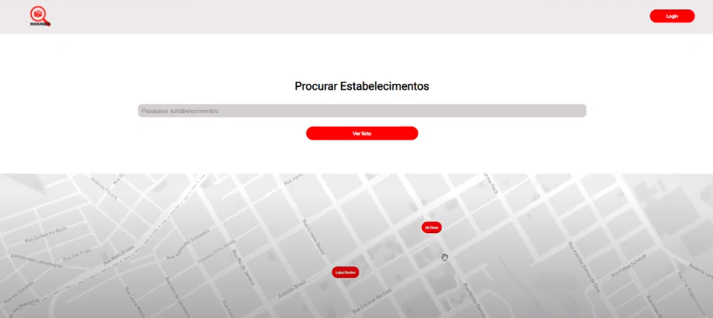

<h1>Aplicação WEB para CRUD de estabelecimentos</h1>

<h3>Video</h3>
Clique na imagem para visualizar o vídeo.

# O que é ?

A aplicação foi desenvolvida com enfoque na web, com a função de listar os estabelecimentos mais próximos da sua localização por uma listagem ou pelo mapa. 

Foi utilizado o React JS, uma biblioteca frontend javascript e opensource. 

Houve também a necessidade do desenvolvimento do backend. Sendo assim, foi criada uma API REST feita em Node JS, com o auxílio de frameworks como o Express, facilitando a troca de informação via HTTP.

Para o armazenamento de dados dos usuários, e seus respectivos produtos, foi utilizado um banco de dados não-relacional: o MongoDB.

# O que foi utilizado?
React  

Node  

MongoDB Atlas  

Axios  - //No axios, você pode interceptar requisições e respostas antes de serem tratados pelo then e pelo catch  

Express -//Auxilio no roteamento, requisições HTTP  

BCrypt - // Encriptar uma senha, garantindo nunca gerar repetido    

Mongoose  -// Conexão com o banco MongoDB    

Cors - //mecanismo que se utiliza de cabeçalhos HTTP para dar permissão de acesso para um User Agent    

Dotenv - //Dotenv para criar variaveis globais e não ficar exposto no GIT    

Create react app - // Utilizado pois o sistema não precisa de SEO, não precisaria adicionar SSG ou SSR.    

React Router Dom - //Lib completa para controle de rotas    

ReactMapGL -// Maps    

# Iniciando a API (foi utilizado o NODE)
1. Clone o repositório com https://github.com/pablopinheiro190/managerFortbrasil  

2. Entre dentro da pasta API.  

3. Instale as dependencias npm install  

4. Rode o projeto com npm run dev  

# Iniciando a aplicação WEB

1. Clone o repositório com https://github.com/pablopinheiro190/managerFortbrasil  

2. Entre dentro da pasta MANAGER.  

3. Instale as dependencias `npm install `

4. Rode o projeto com `npm start` 

# Tela Inicial

O usuário pode pesquisar os estabelecimentos por nome, que serão mostrados na listagem ou no mapa. De acordo com a preferencia.

# Login/Cadastro

Na tela inicial, no botão superior direito, temos a opção do Login ou Cadastro, para seguir a página de cadastros de estabelecimentos.

# Cadastro de estabelecimentos

Na tela de cadastro, pode ser informado o Nome, Endereço, Tipo de segmento e telefone. Existe a possibilidade de exclusão, quando o login estiver feito, apenas estabelecimentos criados pelo usuário irão aparecer.
